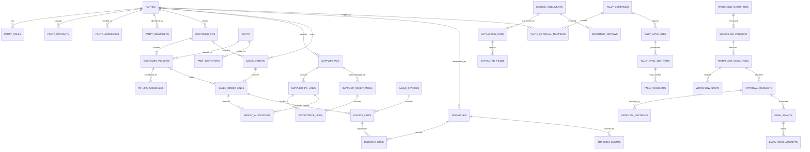

# Complete target schema (provisional)

> Logical proposal only. Not yet backed by an executable migration.

```mermaid
erDiagram
    PARTIES ||--o{ PARTY_ROLES : has
    PARTIES ||--o{ PARTY_CONTACTS : contacts
    PARTIES ||--o{ PARTY_ADDRESSES : located_at
    PARTIES ||--o{ PARTY_IDENTIFIERS : identified_by
    PARTIES ||--o{ CUSTOMER_POS : places
    CUSTOMER_POS ||--|{ CUSTOMER_PO_LINES : contains
    CUSTOMER_PO_LINES ||--o{ PO_LINE_SCHEDULES : scheduled_as
    PARTS ||--o{ CUSTOMER_PO_LINES : ordered_as
    PARTS ||--o{ PART_IDENTIFIERS : coded_as
    PARTIES ||--o{ SUPPLIER_POS : supplies
    SUPPLIER_POS ||--|{ SUPPLIER_PO_LINES : contains
    SUPPLIER_POS ||--o{ SUPPLIER_ACCEPTANCES : acknowledged_by
    SUPPLIER_ACCEPTANCES ||--|{ ACCEPTANCE_LINES : includes
    SUPPLIER_PO_LINES ||--o{ ACCEPTANCE_LINES : accepts
    PARTIES ||--o{ SALES_ORDERS : buys
    CUSTOMER_POS o|--o{ SALES_ORDERS : supports
    SALES_ORDERS ||--|{ SALES_ORDER_LINES : contains
    CUSTOMER_PO_LINES o|--o{ SALES_ORDER_LINES : fulfills
    SALES_ORDER_LINES ||--o{ SUPPLY_ALLOCATIONS : demand
    SUPPLIER_PO_LINES ||--o{ SUPPLY_ALLOCATIONS : supply
    SALES_ORDER_LINES ||--o{ INVOICE_LINES : invoiced
    SALES_INVOICES ||--|{ INVOICE_LINES : contains
    INVOICE_LINES ||--o{ DISPATCH_LINES : dispatched
    DISPATCHES ||--|{ DISPATCH_LINES : contains
    DISPATCHES ||--o{ TRACKING_EVENTS : tracked_by
    PARTIES o|--o{ DISPATCHES : transported_by
    SOURCE_DOCUMENTS ||--o{ EXTRACTION_RUNS : processed_by
    EXTRACTION_RUNS ||--o{ EXTRACTED_FIELDS : returns
    SOURCE_DOCUMENTS ||--o{ DOCUMENT_REVIEWS : reviewed
    PARTIES ||--o{ PARTY_EXTERNAL_MAPPINGS : mapped_to
    TALLY_COMPANIES ||--o{ PARTY_EXTERNAL_MAPPINGS : scopes
    WORKFLOW_DEFINITIONS ||--|{ WORKFLOW_VERSIONS : versioned
    WORKFLOW_VERSIONS ||--o{ WORKFLOW_EXECUTIONS : executes
    WORKFLOW_EXECUTIONS ||--o{ WORKFLOW_STEPS : records
    WORKFLOW_EXECUTIONS ||--o{ APPROVAL_REQUESTS : requests
    APPROVAL_REQUESTS ||--o{ APPROVAL_DECISIONS : decided_by
    APPROVAL_REQUESTS ||--o{ EMAIL_DRAFTS : authorizes
    EMAIL_DRAFTS ||--o{ EMAIL_SEND_ATTEMPTS : sends
    TALLY_COMPANIES ||--o{ TALLY_SYNC_JOBS : imports
    TALLY_SYNC_JOBS ||--o{ TALLY_SYNC_JOB_ITEMS : processes
    TALLY_SYNC_JOB_ITEMS ||--o{ TALLY_CONFLICTS : may_conflict
```
