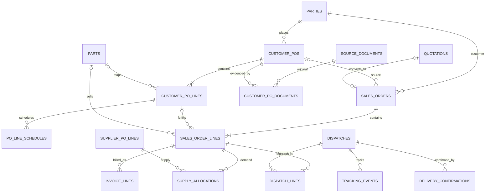

# Customer POs, sales orders, and fulfilment (provisional)

> Logical proposal only. PO/order and schedule cardinalities require final policy confirmation.

```mermaid
erDiagram
    PARTIES ||--o{ CUSTOMER_POS : places
    CUSTOMER_POS ||--|{ CUSTOMER_PO_LINES : contains
    CUSTOMER_PO_LINES ||--o{ PO_LINE_SCHEDULES : schedules
    PARTS o|--o{ CUSTOMER_PO_LINES : maps
    PARTIES ||--o{ SALES_ORDERS : customer
    CUSTOMER_POS o|--o{ SALES_ORDERS : source
    QUOTATIONS o|--o| SALES_ORDERS : converts_to
    SALES_ORDERS ||--|{ SALES_ORDER_LINES : contains
    CUSTOMER_PO_LINES o|--o{ SALES_ORDER_LINES : fulfills
    PARTS o|--o{ SALES_ORDER_LINES : sells
    SALES_ORDER_LINES ||--o{ SUPPLY_ALLOCATIONS : demand
    SUPPLIER_PO_LINES ||--o{ SUPPLY_ALLOCATIONS : supply
    SALES_ORDER_LINES ||--o{ INVOICE_LINES : billed_as
    SALES_ORDER_LINES ||--o{ DISPATCH_LINES : shipped_as
    DISPATCHES ||--|{ DISPATCH_LINES : groups
    DISPATCHES ||--o{ TRACKING_EVENTS : tracks
    DISPATCHES ||--o{ DELIVERY_CONFIRMATIONS : confirmed_by
    SOURCE_DOCUMENTS ||--o{ CUSTOMER_PO_DOCUMENTS : original
    CUSTOMER_POS ||--o{ CUSTOMER_PO_DOCUMENTS : evidenced_by
```
