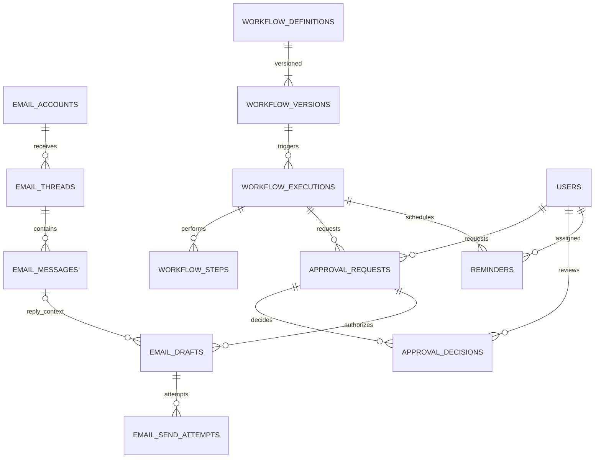

# Email automation and approvals (provisional)

> Logical proposal only. Human approval before send is client-confirmed; workflow triggers/templates remain pending.

```mermaid
erDiagram
    EMAIL_ACCOUNTS ||--o{ EMAIL_THREADS : receives
    EMAIL_THREADS ||--o{ EMAIL_MESSAGES : contains
    WORKFLOW_DEFINITIONS ||--|{ WORKFLOW_VERSIONS : versioned
    WORKFLOW_VERSIONS ||--o{ WORKFLOW_EXECUTIONS : triggers
    WORKFLOW_EXECUTIONS ||--o{ WORKFLOW_STEPS : performs
    WORKFLOW_EXECUTIONS ||--o{ APPROVAL_REQUESTS : requests
    APPROVAL_REQUESTS ||--o{ APPROVAL_DECISIONS : decides
    APPROVAL_REQUESTS ||--o{ EMAIL_DRAFTS : authorizes
    EMAIL_DRAFTS ||--o{ EMAIL_SEND_ATTEMPTS : attempts
    EMAIL_MESSAGES o|--o{ EMAIL_DRAFTS : reply_context
    WORKFLOW_EXECUTIONS ||--o{ REMINDERS : schedules
    USERS ||--o{ APPROVAL_REQUESTS : requests
    USERS ||--o{ APPROVAL_DECISIONS : reviews
    USERS ||--o{ REMINDERS : assigned
```
