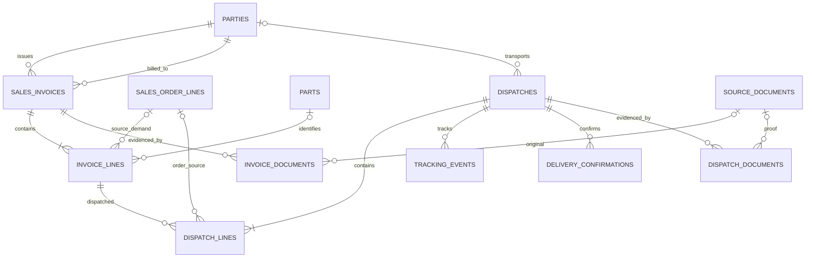

# Invoices, dispatches, and tracking (provisional)

> Logical proposal only. Invoice ownership, dispatch source, numbering, and tax policy are pending.

```mermaid
erDiagram
    PARTIES ||--o{ SALES_INVOICES : issues
    PARTIES ||--o{ SALES_INVOICES : billed_to
    SALES_INVOICES ||--|{ INVOICE_LINES : contains
    SALES_ORDER_LINES o|--o{ INVOICE_LINES : source_demand
    PARTS o|--o{ INVOICE_LINES : identifies
    INVOICE_LINES ||--o{ DISPATCH_LINES : dispatched
    SALES_ORDER_LINES o|--o{ DISPATCH_LINES : order_source
    DISPATCHES ||--|{ DISPATCH_LINES : contains
    PARTIES o|--o{ DISPATCHES : transports
    DISPATCHES ||--o{ TRACKING_EVENTS : tracks
    DISPATCHES ||--o{ DELIVERY_CONFIRMATIONS : confirms
    SOURCE_DOCUMENTS o|--o{ INVOICE_DOCUMENTS : original
    SALES_INVOICES ||--o{ INVOICE_DOCUMENTS : evidenced_by
    SOURCE_DOCUMENTS o|--o{ DISPATCH_DOCUMENTS : proof
    DISPATCHES ||--o{ DISPATCH_DOCUMENTS : evidenced_by
```
