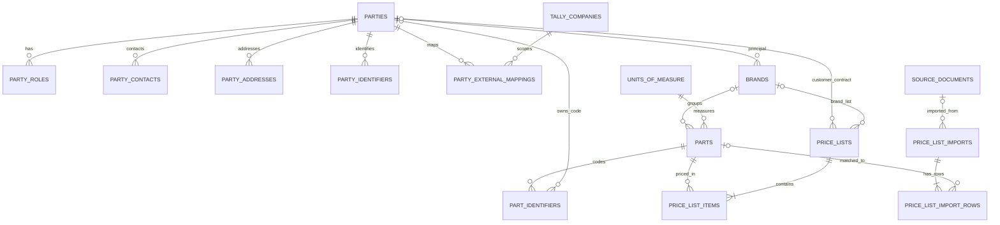

# Parties, products, and pricing (provisional)

> Logical proposal only. Pricing rules and identifier scopes remain pending.

```mermaid
erDiagram
    PARTIES ||--o{ PARTY_ROLES : has
    PARTIES ||--o{ PARTY_CONTACTS : contacts
    PARTIES ||--o{ PARTY_ADDRESSES : addresses
    PARTIES ||--o{ PARTY_IDENTIFIERS : identifies
    PARTIES ||--o{ PARTY_EXTERNAL_MAPPINGS : maps
    TALLY_COMPANIES ||--o{ PARTY_EXTERNAL_MAPPINGS : scopes
    BRANDS o|--o{ PARTS : groups
    PARTIES o|--o{ BRANDS : principal
    UNITS_OF_MEASURE ||--o{ PARTS : measures
    PARTS ||--o{ PART_IDENTIFIERS : codes
    PARTIES o|--o{ PART_IDENTIFIERS : owns_code
    PARTS ||--o{ PRICE_LIST_ITEMS : priced_in
    PRICE_LISTS ||--|{ PRICE_LIST_ITEMS : contains
    PARTIES o|--o{ PRICE_LISTS : customer_contract
    BRANDS o|--o{ PRICE_LISTS : brand_list
    SOURCE_DOCUMENTS o|--o{ PRICE_LIST_IMPORTS : imported_from
    PRICE_LIST_IMPORTS ||--|{ PRICE_LIST_IMPORT_ROWS : has_rows
    PARTS o|--o{ PRICE_LIST_IMPORT_ROWS : matched_to
```
