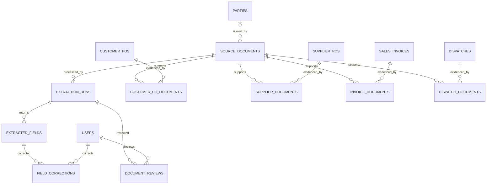

# Source documents and extraction (provisional)

> Logical proposal only. Storage, retention, provider, and extraction confidence semantics remain pending.

```mermaid
erDiagram
    PARTIES o|--o{ SOURCE_DOCUMENTS : issued_by
    SOURCE_DOCUMENTS ||--o{ EXTRACTION_RUNS : processed_by
    EXTRACTION_RUNS ||--o{ EXTRACTED_FIELDS : returns
    EXTRACTION_RUNS ||--o{ DOCUMENT_REVIEWS : reviewed
    EXTRACTED_FIELDS ||--o{ FIELD_CORRECTIONS : corrected
    USERS ||--o{ DOCUMENT_REVIEWS : reviews
    USERS ||--o{ FIELD_CORRECTIONS : corrects
    SOURCE_DOCUMENTS ||--o{ CUSTOMER_PO_DOCUMENTS : supports
    CUSTOMER_POS ||--o{ CUSTOMER_PO_DOCUMENTS : evidenced_by
    SOURCE_DOCUMENTS ||--o{ SUPPLIER_DOCUMENTS : supports
    SUPPLIER_POS ||--o{ SUPPLIER_DOCUMENTS : evidenced_by
    SOURCE_DOCUMENTS ||--o{ INVOICE_DOCUMENTS : supports
    SALES_INVOICES ||--o{ INVOICE_DOCUMENTS : evidenced_by
    SOURCE_DOCUMENTS ||--o{ DISPATCH_DOCUMENTS : supports
    DISPATCHES ||--o{ DISPATCH_DOCUMENTS : evidenced_by
```
