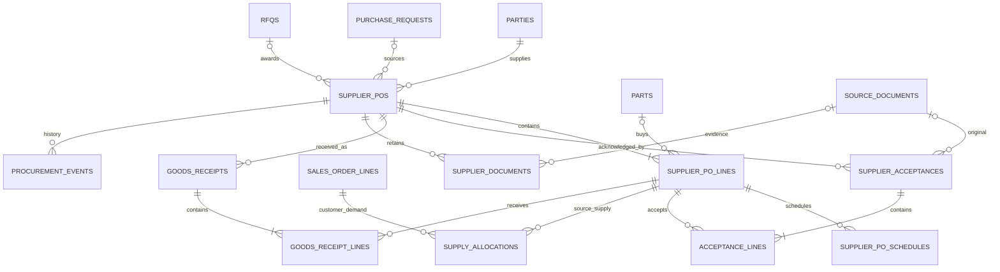

# Supplier POs, acceptances, and procurement allocation (provisional)

> Logical proposal only. Acceptance revision and allocation quantity rules remain pending.

```mermaid
erDiagram
    PARTIES ||--o{ SUPPLIER_POS : supplies
    PURCHASE_REQUESTS o|--o{ SUPPLIER_POS : sources
    RFQS o|--o{ SUPPLIER_POS : awards
    SUPPLIER_POS ||--|{ SUPPLIER_PO_LINES : contains
    PARTS o|--o{ SUPPLIER_PO_LINES : buys
    SUPPLIER_PO_LINES ||--o{ SUPPLIER_PO_SCHEDULES : schedules
    SUPPLIER_POS ||--o{ SUPPLIER_ACCEPTANCES : acknowledged_by
    SUPPLIER_ACCEPTANCES ||--|{ ACCEPTANCE_LINES : contains
    SUPPLIER_PO_LINES ||--o{ ACCEPTANCE_LINES : accepts
    SUPPLIER_PO_LINES ||--o{ SUPPLY_ALLOCATIONS : source_supply
    SALES_ORDER_LINES ||--o{ SUPPLY_ALLOCATIONS : customer_demand
    SUPPLIER_POS ||--o{ GOODS_RECEIPTS : received_as
    GOODS_RECEIPTS ||--|{ GOODS_RECEIPT_LINES : contains
    SUPPLIER_PO_LINES ||--o{ GOODS_RECEIPT_LINES : receives
    SOURCE_DOCUMENTS o|--o{ SUPPLIER_ACCEPTANCES : original
    SOURCE_DOCUMENTS o|--o{ SUPPLIER_DOCUMENTS : evidence
    SUPPLIER_POS ||--o{ SUPPLIER_DOCUMENTS : retains
    SUPPLIER_POS ||--o{ PROCUREMENT_EVENTS : history
```
