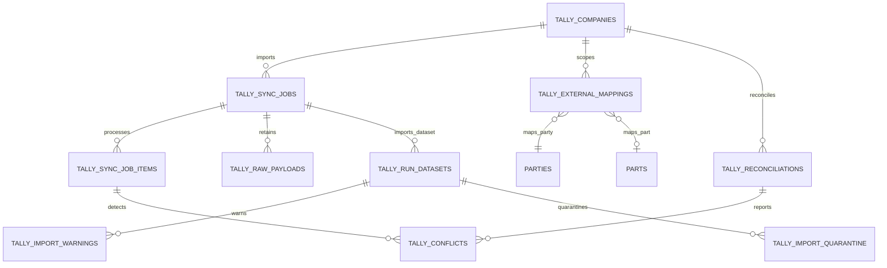

# TallyPrime synchronization and reconciliation (provisional)

> Logical proposal only. Current connector is read-only; any write path is blocked pending approval.

```mermaid
erDiagram
    TALLY_COMPANIES ||--o{ TALLY_SYNC_JOBS : imports
    TALLY_SYNC_JOBS ||--o{ TALLY_SYNC_JOB_ITEMS : processes
    TALLY_COMPANIES ||--o{ TALLY_EXTERNAL_MAPPINGS : scopes
    TALLY_EXTERNAL_MAPPINGS }o--|| PARTIES : maps_party
    TALLY_EXTERNAL_MAPPINGS }o--o| PARTS : maps_part
    TALLY_SYNC_JOB_ITEMS ||--o{ TALLY_CONFLICTS : detects
    TALLY_COMPANIES ||--o{ TALLY_RECONCILIATIONS : reconciles
    TALLY_RECONCILIATIONS ||--o{ TALLY_CONFLICTS : reports
    TALLY_SYNC_JOBS ||--o{ TALLY_RAW_PAYLOADS : retains
    TALLY_SYNC_JOBS ||--o{ TALLY_RUN_DATASETS : imports_dataset
    TALLY_RUN_DATASETS ||--o{ TALLY_IMPORT_WARNINGS : warns
    TALLY_RUN_DATASETS ||--o{ TALLY_IMPORT_QUARANTINE : quarantines
```
